<p align="center">
  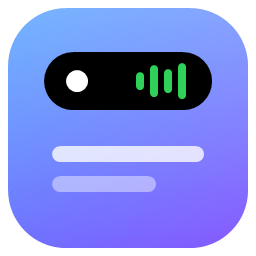
</p>

<h1 align="center">DynamicBay</h1>
<p align="center"><b>Eine Dynamic Island für Windows</b> – inspiriert von NotchNook und dem iPhone.<br/>
Musik, Zwischenablage, Dateiablage, Mitteilungen, Kalender, Timer, Claude und mehr – in einer schwarzen Insel, die sich wie bei Apple mit Federphysik verformt.</p>

<p align="center">
  <a href="https://github.com/SuperSparrow-sys/dynamic-island-win/releases/latest"><b>Installer herunterladen</b></a> ·
  <a href="docs/TROUBLESHOOTING.md">Hilfe</a> ·
  <a href="docs/ARCHITECTURE.md">Architektur</a> ·
  <a href="#english">English</a>
</p>

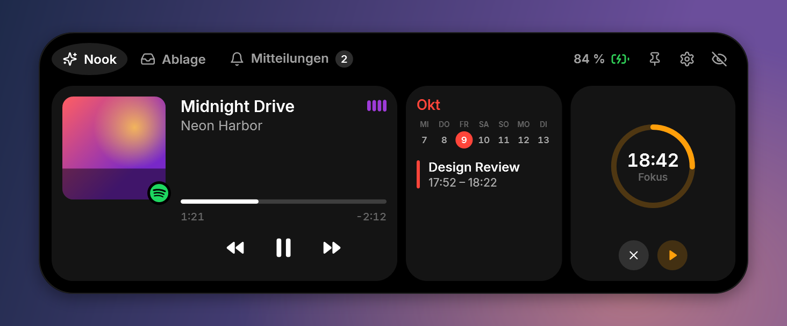

## Funktionen

| | |
|---|---|
| 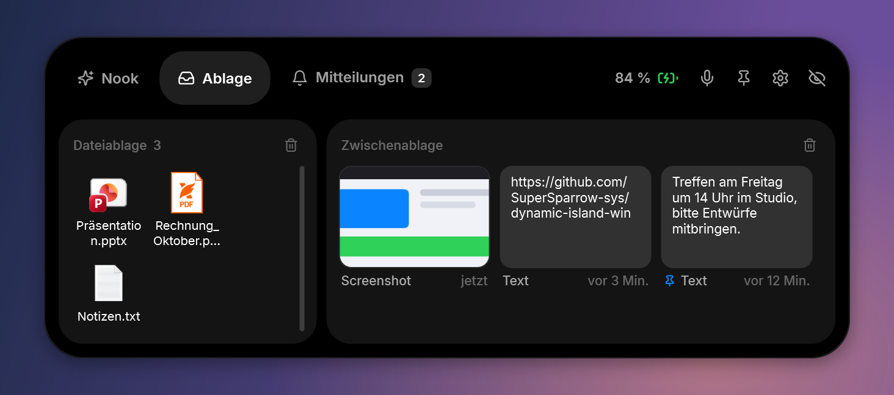 | **Ablage:** Dateien auf die Insel ziehen und später wieder herausziehen. Daneben die **Zwischenablage** mit Screenshots aus dem Snipping Tool (Win + Umschalt + S) und Texten – anheften, speichern, herausziehen oder im Explorer an ihrem Speicherort zeigen. Dateien von anderen Geräten kommen per **Taildrop** (Tailscale) direkt hier an. |
| 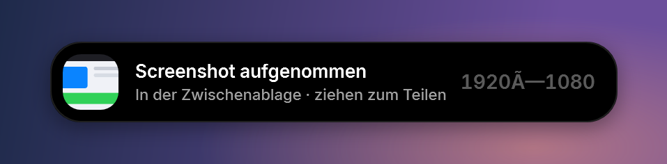 | **Peeks:** Screenshots, Titelwechsel, Akku, Bluetooth-Kopfhörer, Termine, Timer und Mitteilungen anderer Apps (WhatsApp, Outlook, …) erscheinen kurz in der Insel. Windows selbst bleibt dabei stumm und zeigt keine eigenen Banner. |
| 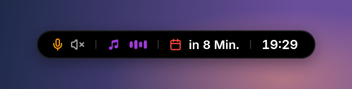 | **Mikrofon und Ton:** Nutzt eine App das Mikrofon oder die Kamera, erscheint vorne in der Insel ein kleines Symbol, ebenso bei Ton aus. Beim Start einer Aufnahme fragt die Insel, ob das Mikrofon stummgeschaltet werden soll – jederzeit auch per Knopf oder Strg + Alt + M. |
| 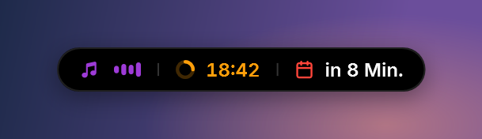 | **Live Activities nebeneinander:** Musik, laufender Timer, nächster Termin, Akku schwach, Uhrzeit oder ein arbeitender Claude-Agent – alles in einer Insel. |
| 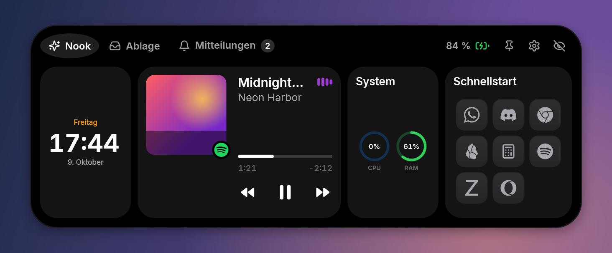 | **Komplett anpassbar:** Widgets wählen und sortieren (Medien, Uhr, Kalender, Timer, System, Schnellstart, Nachrichten, Claude). Schnellstart-Apps (auch Store-Apps wie WhatsApp oder Discord) erscheinen als einheitliche, dunkle Kacheln. |
| 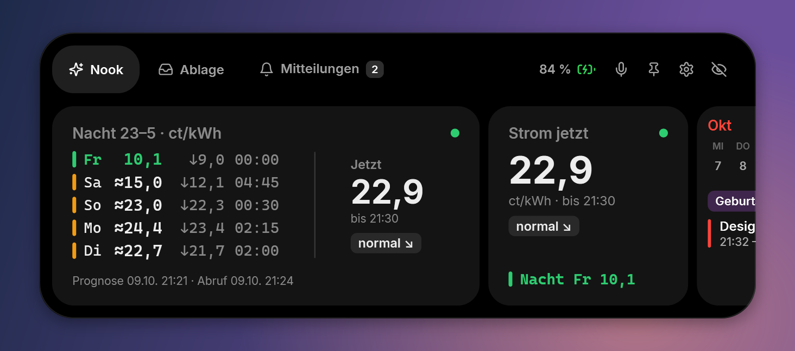 | **Eigene Widgets per Skript:** Widgets selbst in JavaScript schreiben – mit derselben Schnittstelle wie Scriptable auf dem iPhone, z. B. für eigene Daten wie Strompreise, Smart Home oder Server-Status. Wahlweise als große oder kleine Karte oder als Mini-Zeile in der Insel. Skripte laufen in einer geschützten Umgebung ohne Zugriff auf Windows oder deine Dateien. Anleitung: [docs/SCRIPTS.md](docs/SCRIPTS.md). |
| 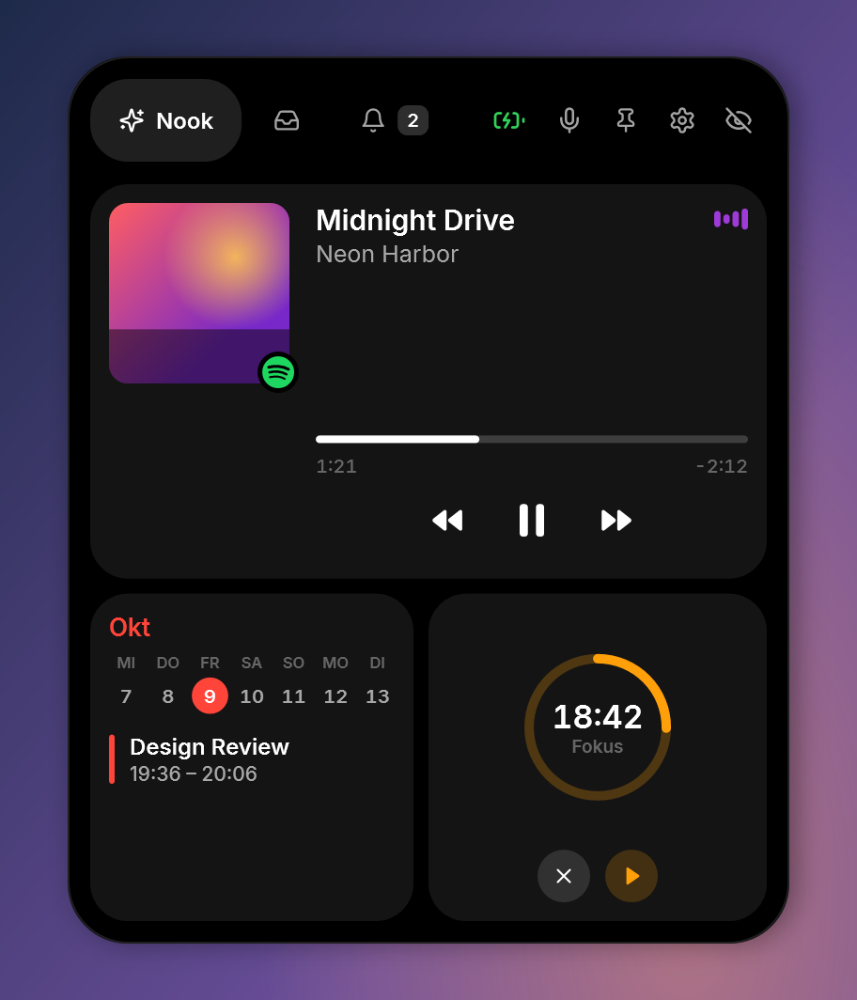 | **Überall platzierbar:** Insel mit der Maus verschieben – sie rastet magnetisch ein und passt Form und Aufklapp-Richtung an (oben, unten, Ecken, senkrecht an den Seiten). Auf einen anderen Bildschirm ziehen oder auf allen Bildschirmen spiegeln. |

**Außerdem:** Spotify, Apple Music und alle anderen Player ohne Anmeldung (optional Spotify-Login für Lieblingssongs, Warteschlange, Playlists und Gerätewahl), Lautstärkeregler nur für die Musik · Audio-Widget für Ausgabe, Mikrofon und AirPods · Notizen · Zeiterfassung mit eigenem Fenster · Downloads in der Insel · zweite Seite „System“ · Notch-Design wie beim MacBook · Kalender aus iCloud, Google und Outlook · Timer und Pomodoro · Akku- und Bluetooth-Anzeigen · Claude-Code-Sitzungen mit Live-Status und Remote Control · schwebend, über allem (auch im Vollbild) oder nur auf dem Desktop · Verstecken per Tastenkürzel, Auto-Hide, im Vollbild · Deutsch und Englisch.

## Installation

1. [`DynamicBay-Setup-x.y.z.exe`](https://github.com/SuperSparrow-sys/dynamic-island-win/releases/latest) herunterladen und ausführen.
2. Fertig – die Insel erscheint oben in der Mitte. Rechtsklick auf das Tray-Symbol oder das Zahnrad in der Insel öffnet die Einstellungen.

Alles Nötige ist enthalten (die .NET-Laufzeit wird mitinstalliert). Voraussetzung: Windows 10 Version 2004 oder Windows 11, 64 Bit.
Der Installer ist nicht von einer Zertifizierungsstelle signiert – Windows SmartScreen zeigt deshalb evtl. „Unbekannter Herausgeber“ (*Weitere Informationen* → *Trotzdem ausführen*).

## Einstellungen

| | |
|---|---|
| 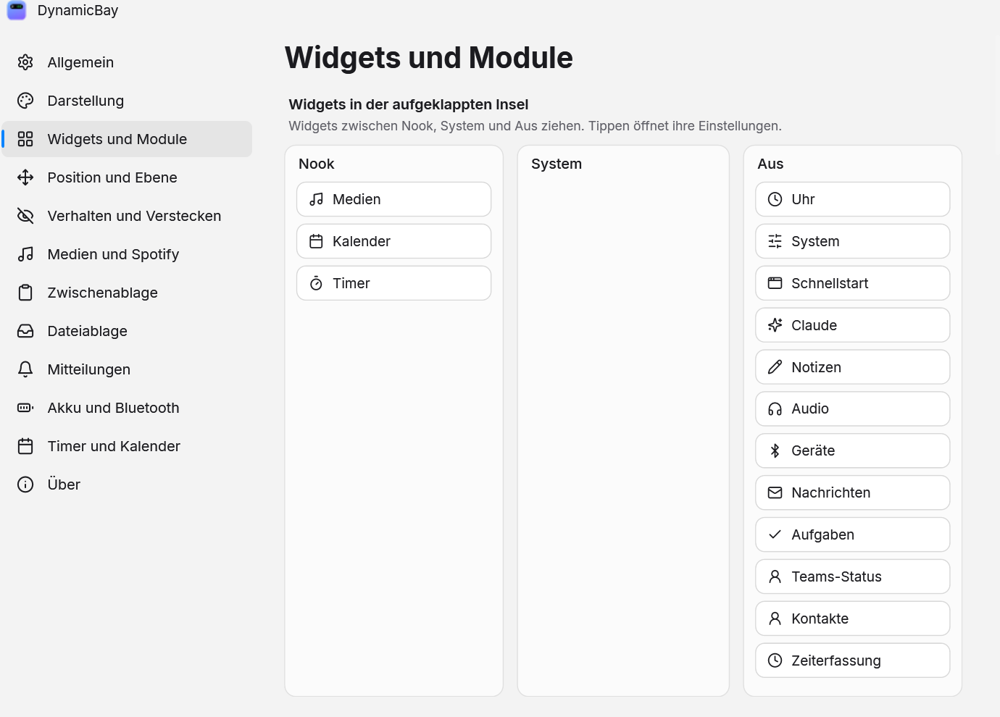 | 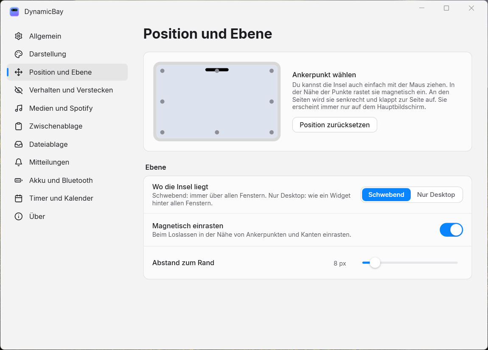 |

Anleitungen: [Spotify verbinden](docs/INTEGRATIONS.md#spotify) · [Kalender (iCloud, Google, Outlook)](docs/INTEGRATIONS.md#kalender) · [Mitteilungen anderer Apps](docs/INTEGRATIONS.md#mitteilungen) · [Claude](docs/INTEGRATIONS.md#claude)

## Selbst bauen

```powershell
git clone https://github.com/SuperSparrow-sys/dynamic-island-win
cd dynamic-island-win
dotnet run --project src/DynamicBay          # starten
dotnet test tests/DynamicBay.Tests           # Tests
powershell -File tools/build-release.ps1     # Installer nach artifacts/
```

Benötigt: .NET 9 SDK, für den Installer zusätzlich Inno Setup 6 und das Windows SDK. Details in [docs/DEVELOPMENT.md](docs/DEVELOPMENT.md).

## Datenschutz

Keine Telemetrie. Alles bleibt lokal in `%AppData%\DynamicBay`. Passwörter und Tokens (Spotify, iCloud, Google) werden mit Windows DPAPI verschlüsselt gespeichert. Die einzigen Netzwerkzugriffe sind die von dir verbundenen Dienste und ein Update-Check gegen GitHub (abschaltbar).

## Danksagungen

Icons: [Lucide](https://lucide.dev) (ISC) und [Simple Icons](https://simpleicons.org) (CC0, Marken gehören ihren Inhabern) · Schrift: [Inter](https://rsms.me/inter) (SIL OFL) · Inspiration: NotchNook und die Dynamic Island von Apple. DynamicBay steht in keiner Verbindung zu Apple, Spotify, Google oder Anthropic.

Lizenz: [MIT](LICENSE)

---

<a id="english"></a>
## English

**DynamicBay** is a Dynamic Island for Windows inspired by NotchNook: media controls (Spotify, Apple Music, any player), clipboard history with Snipping Tool screenshots, a file shelf, mirrored notifications from other apps, calendars (iCloud, Google, Outlook), timers, battery and Bluetooth peeks, a launcher, Claude Code session status, own widgets written in JavaScript (Scriptable-compatible, sandboxed) – all inside a black island that morphs with spring physics. It can be dragged anywhere, docks to edges and corners (vertical on the sides), works on multiple displays and is fully customizable.

Download the installer from [Releases](https://github.com/SuperSparrow-sys/dynamic-island-win/releases/latest). Everything needed is included. Windows 10 2004+ / Windows 11, x64. See [docs/](docs) for architecture, integrations and troubleshooting.
